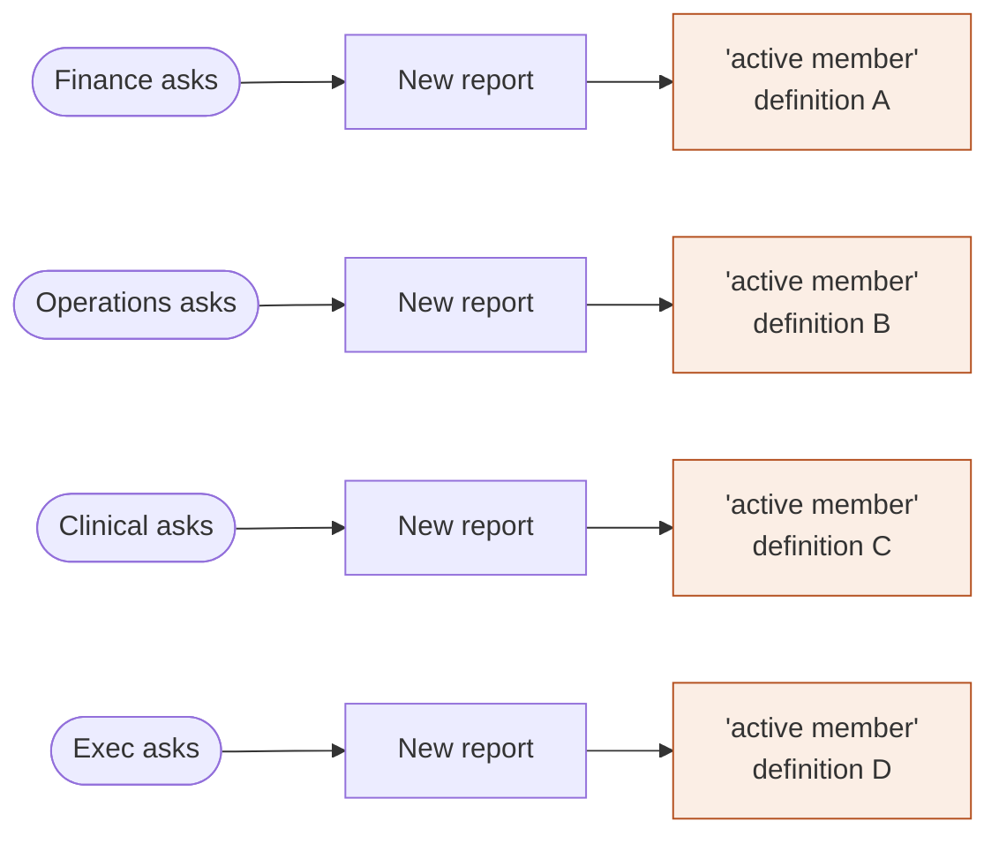
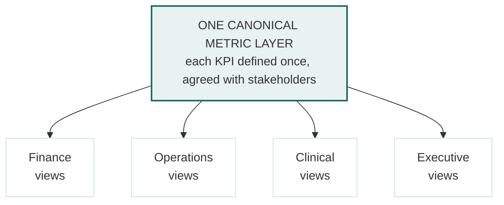

# Sanika Kalvikatte

**Information architecture · Product design**

Eight years deciding where information lives inside healthcare data systems. 
Now doing that work at the interface.

[**View the portfolio →**](https://sanikakalvikatte.github.io)

`Boston, MA` · `M.S. Health Informatics, Northeastern` · [sanika.kalvikatte001@gmail.com](mailto:sanika.kalvikatte001@gmail.com)

---

> [!NOTE]
> **Why a data person is applying for design roles.** Dimensional modeling and semantic design are information architecture wearing a technical costume. What is this entity, what do we call it, and where should a person expect to find it — the same questions a navigation system answers. I've been answering them for eight years, for people who had to act on the answer.

---

## Case study — a reporting estate that grew by accident

**Infowave Systems** · Power BI, SQL Server, PySpark

Enterprise reporting had grown request by request, team by team, over several years. Every new question produced a new report instead of a change to an existing one. Nobody had designed the estate as a whole, because nobody was ever asked to.

### The structure I inherited

Grouped by **who asked**, not by what anyone was trying to find out. The same metric computed four ways, none of them canonical, none documented. Nobody could tell which report to trust.

### The structure I built

Grouped by **the question being asked**. Alternate cuts became views inheriting one definition, not separate places with separate logic.

### How

| | | |
|:--|:--|:--|
| **01** | Audit before building | ⬜ *[fill: how you inventoried what existed]* |
| **02** | Define the metric layer | One canonical definition per KPI, agreed with stakeholders, inherited everywhere |
| **03** | Regroup by question | Organized around what people need to find out, not who requested it |
| **04** | Retire and consolidate | ⬜ *[fill: how many merged or decommissioned]* |
| **05** | Test before shipping | ⬜ *[fill: what a stakeholder got wrong in UAT, and what you changed because of it]* |

> [!IMPORTANT]
> **What changed** — ⬜ *[fill: real numbers only. Reports retired, refresh reliability, drop in ad-hoc requests. If you didn't measure it, say what you observed instead — that reads as more credible, not less.]*

<b>What this taught me about design</b>

 

⬜ *[fill: the section hiring managers read hardest. What you got wrong, what you'd do differently, what surprised you about people. Two or three sentences, in your own voice.]*

---

## Where the structural instinct came from

| Years | Where | Role | What it taught me |
|:--|:--|:--|:--|
| **2023 – now** | Infowave Systems | BI & Reporting Analyst | Translating business questions into structure people can navigate |
| **2022** | Cohere Health | Data Analyst | Self-service is an IA problem — people serve themselves only if they can find the thing. *Manual effort cut in half.* |
| **2021** | KPI Ninja / Health Catalyst | BI Analyst | Two teams using the same words differently is a taxonomy problem before a technical one |
| **2018 – 2021** | CitiusTech | Analytics Engineer | Structure has consequences. *Billing accuracy +20%, denials −15%.* |

---

## Honest inventory

**Transfers directly**

`Information architecture` `Semantic & dimensional modeling` `Stakeholder translation` `UAT & validation` `Root cause analysis` `SQL` `Python` `PySpark` `dbt` `Power BI` `Tableau` `Looker`

**Still building**

⬜ *[fill: name them specifically — Figma, prototyping, interaction craft, visual systems, accessibility. Naming these accurately reads as maturity, not weakness.]*

---

Portfolio built as a single static HTML file — no frameworks, no dependencies. 
Diagrams above render natively in GitHub via Mermaid.

